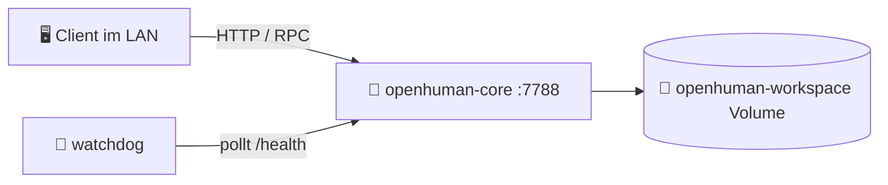

# 🚀 hAI.OpenHumanCoreLAN — OpenHuman Core im LAN mit Portainer


> 🧠 **OpenHuman Core** als Docker-Stack in **Portainer**, lokal im **LAN** erreichbar, mit **Docker-Healthcheck** und **Watchdog-Sidecar** für Statusüberwachung.

---

## ✨ Features

- 🐳 Deployment als **Portainer Stack** (Docker Compose)
- 🌐 Zugriff im LAN über `http://<SERVER-IP>:7788`
- ❤️ Docker-interner **Healthcheck** auf `/health`
- 👀 **Watchdog-Sidecar**, der den Core alle 30 Sekunden prüft und loggt
- 💾 Persistente Datenhaltung über Docker-Volume
- 🔐 RPC-Zugriff per Bearer-Token
- 🧩 Vorbereitung für lokale KI-Anbindung (z. B. LM Studio oder Ollama)

---

## 🧱 Architektur



---

## 📂 Projekt-Struktur

```txt
hAI.OpenHumanCoreLAN/
├─ README.md              # Dieses Dokument
├─ LICENSE                # MIT-Lizenz
├─ docker-stack.yml       # Portainer-Stack für OpenHuman Core
├─ .env.template          # Vorlage für Umgebungsvariablen
├─ example.env            # Beispiel-Env für schnelles Starten
├─ compose.override.yml   # Lokale Overrides (optional)
├─ .gitignore             # Ignore-Regeln für Git
└─ banner.svg             # Einfaches Repo-Banner/Icon
```

---

## 📦 Services im Stack

| Service             | Port  | Aufgabe                                                  |
|---------------------|------:|----------------------------------------------------------|
| `openhuman-core`    | `7788`| Rust-Backend / JSON-RPC-Server                          |
| `openhuman-watchdog`|  —    | Prüft `/health` alle 30 s und schreibt Status ins Log   |

---

## ❤️ Healthcheck-Konzept

### 1. Docker-Healthcheck

Portainer zeigt direkt an, ob der Container **healthy** oder **unhealthy** ist.  
Healthcheck läuft im Container und pingt `http://localhost:7788/health`.

```yaml
healthcheck:
  test: ["CMD", "curl", "-fsS", "--max-time", "3", "http://localhost:7788/health"]
  interval: 30s
  timeout: 5s
  start_period: 20s
  retries: 3
```

### 2. Watchdog-Sidecar

Der Sidecar-Container prüft zusätzlich über das Docker-Netzwerk:

```text
http://openhuman-core:7788/health
```

Beispiel-Logs:

```bash
docker logs -f openhuman-watchdog
```

```txt
[watchdog] 2026-05-17 19:00:00 OK — {"status":"ok"}
[watchdog] 2026-05-17 19:00:30 FEHLER — Core nicht erreichbar (Exit: 1)
```

---

## 🚀 Deployment in Portainer

1. **Bearer-Token erzeugen** (für `OPENHUMAN_CORE_TOKEN`):

   ```bash
   openssl rand -hex 32
   ```

2. **Portainer öffnen** → `Stacks` → `Add Stack`
3. Stack-Name z. B. `hAI.OpenHumanCoreLAN`
4. Inhalt von `docker-stack.yml` in den Web-Editor einfügen
5. Env-Variablen aus `.env`/`.env.template` setzen (mindestens `OPENHUMAN_CORE_TOKEN`)
6. **Deploy the Stack** klicken

---

## 🌐 Zugriff im LAN

| Zweck        | URL                                   |
|-------------|----------------------------------------|
| Healthcheck | `http://<SERVER-IP>:7788/health`       |
| RPC         | `http://<SERVER-IP>:7788/rpc`          |

Beispiel:

```bash
curl http://192.168.1.100:7788/health
```

Mit Bearer-Token für RPC:

```bash
curl -H "Authorization: Bearer DEIN_TOKEN" \
     http://192.168.1.100:7788/rpc
```

---

## 🔐 Beispiel `.env`

> Kopiere `.env.template` nach `.env` und passe die Werte an.

```env
OPENHUMAN_CORE_TOKEN=HIER_SICHERES_TOKEN_EINTRAGEN
OPENHUMAN_CORE_PORT=7788
BACKEND_URL=https://api.tinyhumans.ai

# Optional
JWT_TOKEN=
OPENHUMAN_MODEL=
OPENHUMAN_TEMPERATURE=0.7
OPENHUMAN_WEB_SEARCH_MAX_RESULTS=5
OPENHUMAN_WEB_SEARCH_TIMEOUT_SECS=10
RUST_LOG=info
RUST_BACKTRACE=0
OPENHUMAN_ANALYTICS_ENABLED=false
OPENHUMAN_BROWSER_ALLOW_ALL=0
OPENHUMAN_LOG_PROMPTS=0
OPENHUMAN_REASONING_ENABLED=
OPENHUMAN_LOCAL_AI_TIER=
OPENHUMAN_LM_STUDIO_BASE_URL=http://host.docker.internal:1234/v1
OLLAMA_BIN=
OPENHUMAN_PROXY_ENABLED=false
OPENHUMAN_HTTP_PROXY=
OPENHUMAN_HTTPS_PROXY=
```

---

## 🐳 `docker-stack.yml`

```yaml
# ============================================================
# OpenHuman Core — Portainer Stack für LAN-Betrieb
# inkl. Docker-Healthcheck und Watchdog-Sidecar
# ============================================================

version: "3.9"

services:

  openhuman-core:
    image: ghcr.io/tinyhumansai/openhuman-core:latest
    container_name: openhuman-core
    restart: unless-stopped

    ports:
      - "${OPENHUMAN_CORE_PORT:-7788}:7788"

    environment:
      OPENHUMAN_CORE_HOST: "0.0.0.0"
      OPENHUMAN_CORE_PORT: "7788"
      OPENHUMAN_WORKSPACE: "/home/openhuman/.openhuman"
      OPENHUMAN_CORE_TOKEN: "${OPENHUMAN_CORE_TOKEN}"
      BACKEND_URL: "${BACKEND_URL:-https://api.tinyhumans.ai}"
      RUST_LOG: "${RUST_LOG:-info}"
      RUST_BACKTRACE: "${RUST_BACKTRACE:-0}"
      OPENHUMAN_MODEL: "${OPENHUMAN_MODEL:-}"
      OPENHUMAN_TEMPERATURE: "${OPENHUMAN_TEMPERATURE:-0.7}"
      OPENHUMAN_WEB_SEARCH_MAX_RESULTS: "${OPENHUMAN_WEB_SEARCH_MAX_RESULTS:-5}"
      OPENHUMAN_ANALYTICS_ENABLED: "${OPENHUMAN_ANALYTICS_ENABLED:-false}"

    volumes:
      - openhuman-workspace:/home/openhuman/.openhuman

    healthcheck:
      test: ["CMD", "curl", "-fsS", "--max-time", "3", "http://localhost:7788/health"]
      interval: 30s
      timeout: 5s
      start_period: 20s
      retries: 3

    networks:
      - openhuman-net

    deploy:
      resources:
        limits:
          memory: 1G
          cpus: "2.0"
        reservations:
          memory: 256M

    labels:
      - "com.portainer.stack=hAI.OpenHumanCoreLAN"
      - "traefik.enable=false"

  openhuman-watchdog:
    image: alpine:latest
    container_name: openhuman-watchdog
    restart: unless-stopped
    depends_on:
      openhuman-core:
        condition: service_healthy

    command: >
      sh -c "
        echo '[watchdog] Starte Health-Monitoring für openhuman-core...' &&
        while true; do
          TIMESTAMP=$$(date '+%Y-%m-%d %H:%M:%S');
          RESPONSE=$$(wget -q -O- --timeout=5 http://openhuman-core:7788/health 2>&1);
          STATUS=$$?;
          if [ $$STATUS -eq 0 ]; then
            echo \"[watchdog] $${TIMESTAMP} OK — $${RESPONSE}\";
          else
            echo \"[watchdog] $${TIMESTAMP} FEHLER — Core nicht erreichbar (Exit: $${STATUS})\";
          fi;
          sleep 30;
        done
      "

    networks:
      - openhuman-net

    deploy:
      resources:
        limits:
          memory: 32M
          cpus: "0.1"

    labels:
      - "com.portainer.stack=hAI.OpenHumanCoreLAN"

volumes:
  openhuman-workspace:
    name: openhuman-workspace

networks:
  openhuman-net:
    name: openhuman-net
    driver: bridge
```

---

## ⚙️ `compose.override.yml` (optional)

Für lokale Anpassungen ohne den Haupt-Stack zu ändern:

```yaml
version: "3.9"

services:
  openhuman-core:
    environment:
      # Beispiel: ausführlicheres Logging
      RUST_LOG: "debug"

  openhuman-watchdog:
    environment:
      # Beispiel: hier könntest du das Intervall im Skript auswerten
      # WATCHDOG_INTERVAL_SECS: 15
      :
```

---

## 🧪 `example.env`

```env
# Beispiel-Umgebungsvariablen für hAI.OpenHumanCoreLAN
# Kopiere diese Datei zu `.env` und passe die Werte an.

OPENHUMAN_CORE_TOKEN=BITTE_HIER_SICHERES_TOKEN_EINTRAGEN
OPENHUMAN_CORE_PORT=7788
BACKEND_URL=https://api.tinyhumans.ai

# Optional
JWT_TOKEN=
OPENHUMAN_MODEL=
OPENHUMAN_TEMPERATURE=0.7
OPENHUMAN_WEB_SEARCH_MAX_RESULTS=5
OPENHUMAN_WEB_SEARCH_TIMEOUT_SECS=10
RUST_LOG=info
RUST_BACKTRACE=0
OPENHUMAN_ANALYTICS_ENABLED=false
OPENHUMAN_BROWSER_ALLOW_ALL=0
OPENHUMAN_LOG_PROMPTS=0
OPENHUMAN_REASONING_ENABLED=
OPENHUMAN_LOCAL_AI_TIER=
OPENHUMAN_LM_STUDIO_BASE_URL=http://host.docker.internal:1234/v1
OLLAMA_BIN=
OPENHUMAN_PROXY_ENABLED=false
OPENHUMAN_HTTP_PROXY=
OPENHUMAN_HTTPS_PROXY=
```

---

## 🧾 CHANGELOG (Kurzfassung)

```md
# Changelog

Alle nennenswerten Änderungen an **hAI.OpenHumanCoreLAN** werden hier dokumentiert.

## [0.1.0] - 2026-05-18
### Added
- Initialer Portainer-Stack `docker-stack.yml` für OpenHuman Core im LAN
- Watchdog-Sidecar für `/health`-Monitoring
- Beispiel-Umgebungsvariablen (`.env.template`, `example.env`)
- Ausführliche `README.md` mit Badges, Diagramm und Befehlen
- MIT-Lizenz
```


---

## 📜 Lizenz (MIT)

> Dieses Projekt **hAI.OpenHumanCoreLAN** steht unter der MIT-Lizenz.  
> Die vollständige Lizenz findest du in der Datei `LICENSE` im Repo.

```text
MIT License

Copyright (c) 2026

Permission is hereby granted, free of charge, to any person obtaining a copy
of this software and associated documentation files (the "Software"), to deal
in the Software without restriction, including without limitation the rights
to use, copy, modify, merge, publish, distribute, sublicense, and/or sell
copies of the Software, and to permit persons to whom the Software is
furnished to do so, subject to the following conditions:

[... vollständiger MIT-Text in LICENSE ...]
```
